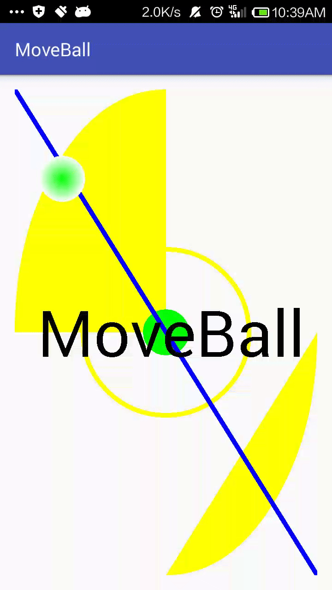

# MoveBall

这个Android应用程序主要用于学习如何编写自定义的View，整个过程中，[程梦真](https://github.com/chengcnaplex)提供了很多建议和帮助。

## 运行效果

## Author

* [曽剑锋](http://www.cnblogs.com/zengjfgit/)
* [程梦真](https://github.com/chengcnaplex)
